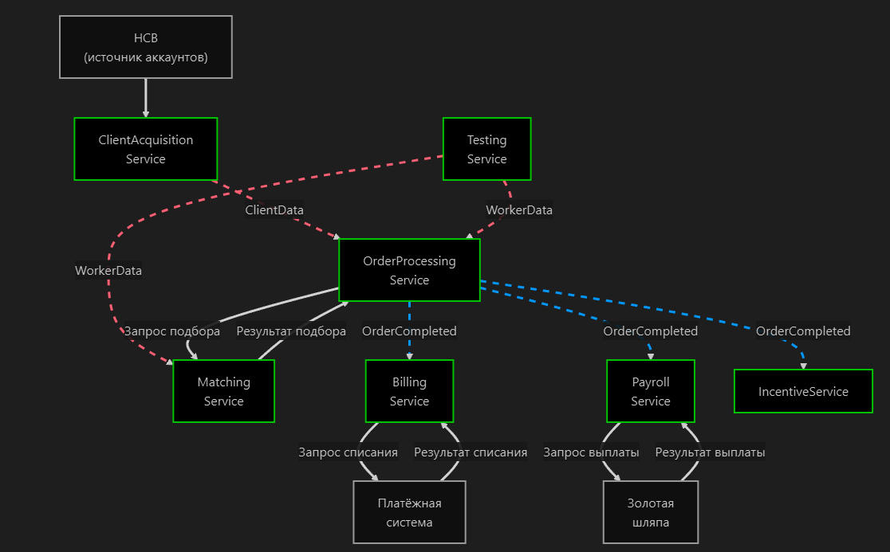
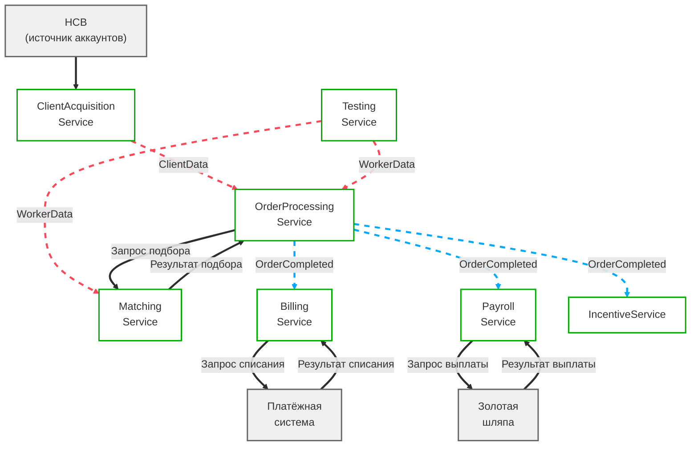

# Карта коммуникаций между микросервисами MCF (Mermaid)

**Легенда:**
-  **Белые сплошные** — синхронная коммуникация (Request-Response)
- 🔵 **Синие пунктирные** — бизнес-события (Event Sourcing)
- 🔴 **Красные пунктирные** — стриминг данных
- **Зелёные блоки** — микросервисы MCF
- **Серые блоки** — внешние системы
