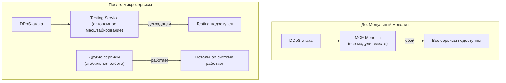

ADR-001: Выделение Testing Service в отдельный микросервис

**Status:** Accepted  
**Date:** 2026-06-09  
**Deciders:** Архитектурная команда MCF

---

## Context

### Требования (User Stories)

- **US-081:** Ожидаем 1к заявок/день, конкуренты могут DDoS-атаковать систему тестирования
- **US-110:** Менеджеры конфигурируют тесты, критично быстро проверять гипотезы
- **Топ-менеджмент:** Продажа Testing как продукт другим компаниям

### Характеристики (вытекают из требований)

| Характеристика | Уровень | Обоснование |
|----------------|---------|-------------|
| **Scalability** | Высокая | DDoS-атаки требуют эластичности (1к заявок/день) |
| **Agility** | Высокая | Быстрая проверка гипотез менеджерами |
| **Deployability** | Высокая | Недельный релизный цикл |
| **Securability** | Высокая | Защита от DDoS + персональные данные котов |

### Противоречия с другими BC

| Характеристика | Testing Service | Остальные BC | Конфликт |
|----------------|-----------------|--------------|----------|
| **Scalability** | Высокая (DDoS) | Низкая/Средняя | ❌ Противоречие |
| **Deployability** | Высокая (недельный релиз) | Средняя (месячный релиз) | ❌ Противоречие |
| **Назначение** | Продажа как продукт | Внутреннее использование | ❌ Противоречие |

---

## Decision

Выделить Testing в отдельный микросервис с:
- Автономным масштабированием (Kubernetes HPA)
- Отдельным CI/CD pipeline (недельный релиз)
- Отдельной инфраструктурой (изоляция от DDoS)
- API-first подходом (для продажи как SaaS)

### Диаграмма: До и После

---

## Consequences

### ✅ Положительные

- **Изоляция от DDoS** — атака на Testing не влияет на другие сервисы
- **Независимый релизный цикл** — недельные релизы без блокировки других команд
- **Возможность продажи как SaaS** — API-first подход, отдельная инфраструктура
- **Автономное масштабирование** — Kubernetes HPA под нагрузку
- **Быстрая проверка гипотез** — менеджеры могут тестировать идеи без ожидания месячного релиза

### ❌ Отрицательные

- **Дополнительная инфраструктура** — отдельный кластер Kubernetes, мониторинг, логи
- **Сложность API контрактов** — нужно поддерживать совместимость с другими сервисами
- **Операционные расходы** — деплой, поддержка, alerting для отдельного сервиса
- **Сложность для команды** — нужно управлять двумя сервисами вместо одного

---

## Alternatives Considered

### 1. Модуль в монолите

**Описание:** Testing как модуль внутри MCF Monolith

**Отклонено:**
- ❌ DDoS-атака на Testing влияет на всю систему
- ❌ Невозможна продажа как продукт (нет отдельного API)
- ❌ Месячный релиз блокирует быструю проверку гипотез

### 2. Отдельный модуль с rate limiting

**Описание:** Testing как модуль с rate limiting и circuit breaker

**Отклонено:**
- ❌ Rate limiting не защищает от DDoS (атака может быть распределённой)
- ❌ Нельзя продать как SaaS (часть монолита)
- ❌ Релизный цикл остаётся месячным

### 3. Внешний SaaS

**Описание:** Использование внешнего сервиса для тестирования

**Отклонено:**
- ❌ Секретность алгоритмов тестирования (конкуренты могут узнать)
- ❌ Зависимость от подрядчика (SLA, доступность)
- ❌ Невозможность кастомизации под требования MCF